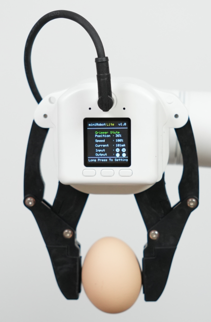

# Product Display

# 1 Product Introduction
myCobot Pro force-controlled gripper is a high-performance robot end effector designed for multi-functional grasping needs. Made of PC and PBT materials, it is manufactured through precision injection molding to ensure the firmness and durability of the product. The gripping range of the gripper is 0-100 mm (default fingertip), and it supports multi-speed torque adjustment to meet the grasping needs of different forces. The rated load is 500 grams, and the repeatability accuracy is 0.5 mm, which can adapt to various robot grasping operation scenarios.

# 2 Applicable models
ER myCobot 320 series

ER Mercury A/B/X series

ER myCobot Pro 630

Other general robots

# 3 Applicable scenarios
Experimental operation: In scientific research experiments, complete the grasping and moving of test tubes, utensils, etc. to ensure the safety and accuracy of the experiment.

Educational demonstration: As a teaching tool, it helps students understand the principles of robot grasping and cultivate practical skills.

Material handling: In simulated production lines or warehouses, materials of various specifications are handled to improve work efficiency.
