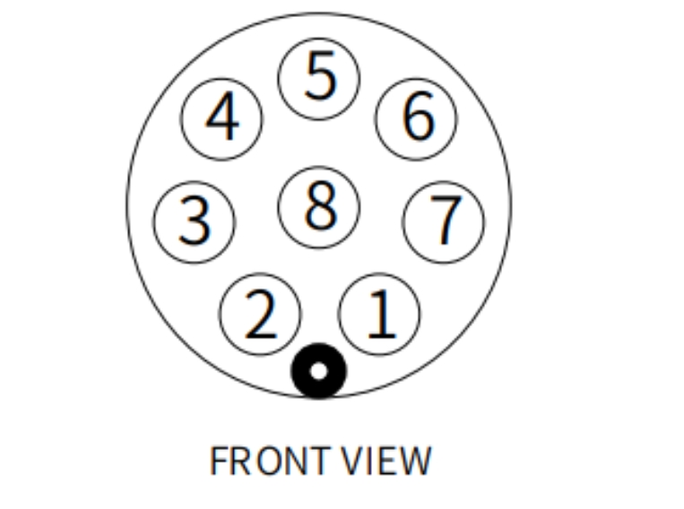
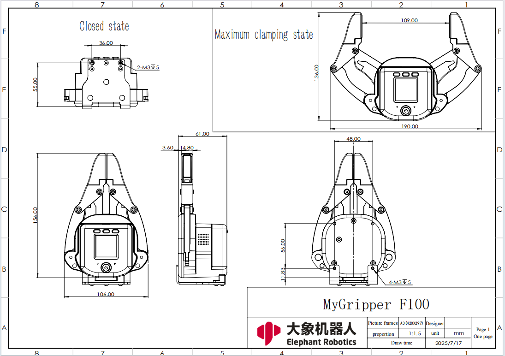

# Product Features
## 1 Product Specifications
| Name | myGripper F100 force-controlled gripper |
| :----------- | :-------------------------------------- |
| Material | PC, PBT |
| Dimensions | 156X106X61mm |
| Process technology | Injection molding |
| Gripping range | 0-100 mm (default fingertip) |
| Repeatability | 0.5 mm |
| Service life | 300,000 openings and closings |
| Drive mode | Electric drive |
| Transmission mode | Gear + connecting rod |
| Weight | 340 g |
| Rated load | 500g |
| Working voltage | 24V |
| Fixing method | Screw fixing |
| Environment requirements | Normal temperature and pressure |
| Control interface | RS485/IO control/button control |
| Cable interface model | M8-8PIN |

**Pin sequence description**

Numbers 1 and 5 connect GND and 24V, numbers 2 and 3 are for controlling IO input, numbers 6 and 7 are for IO output, and numbers 4 and 8 are for 485 communication, which is to receive and send instructions with the gripper

**Notes**:

Please distinguish the line sequence according to the line mark. If the line mark is lost, detached, or forgotten, please contact our staff to cooperate in determining the line sequence. If you do not contact our staff, you will be responsible for the consequences of the damage to the gripper due to the wrong wiring sequence.

## 2 Main controller specification parameter table

| Name | ESP32 |
| :----------- | :-------------------------------------- |
| Core parameters | 240MHz dual core. 600 DMIPS, 520KB SRAM. Wi-Fi, dual mode Bluetooth |
| Flash | 4MB |

## 3 Structural parameters

