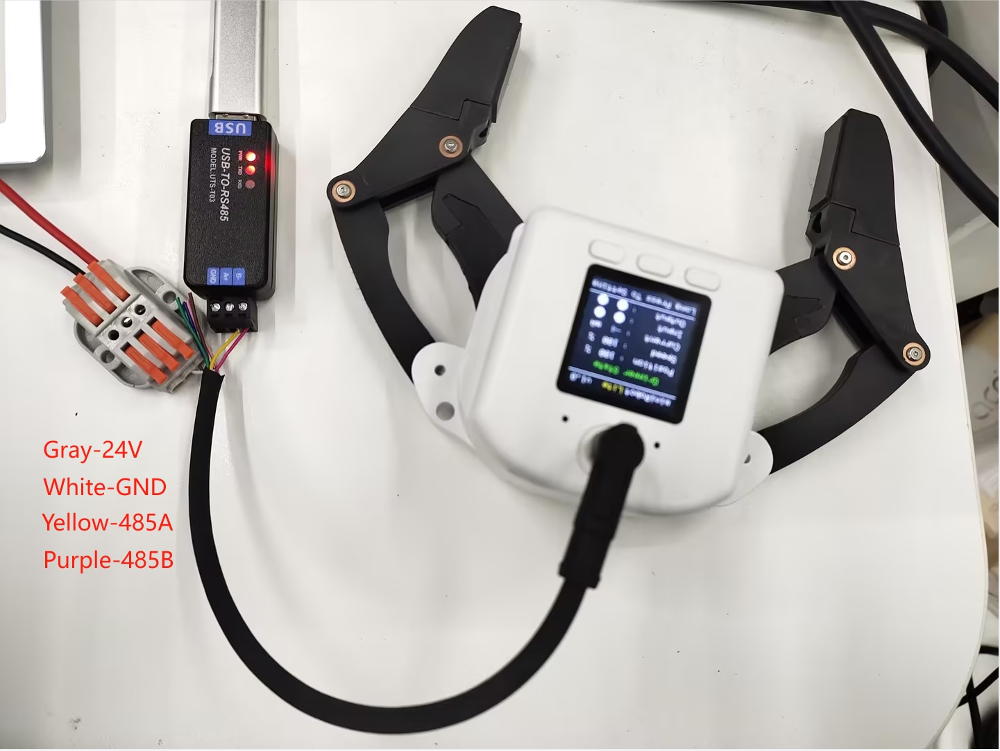

# First installation and use

## 1 Direct connection between the gripper and the end of the robot
**Note**: Only the ER myCobot 320 series, ER Mercury A/B/X series, ER myCobot Pro 630, and ER myCobot Pro 600 can be directly connected to the gripper through the M8 aviation plug line. For other manufacturers' robots, refer to the wiring sequence of the gripper to rewire

**Take mycobot320 as an example, other models can refer to this step for installation**
Use screws and gaskets to install the gripper connector to the end flange of the robot

Then use screws to install the gripper on the connector

Finally, use the M8 aviation line to connect the gripper and the robot

## 2 Gripper and USB485 module connection

**USB-485 module wiring**:

Connect 24V, GND, 485_A (T/R+, 485+), 485_B (T/R-, 485-) at the gripper end, a total of 4 wires, the power supply is a 24V DC regulated power supply, insert the module's USB port into the computer's USB port

485A connected to 485 to USB module A+; 
485B connected to 485 to USB module B-; 
24V connected to 24V DC regulated power supply positive pole; 
GND connected to 24V Negative pole of DC regulated power supply 