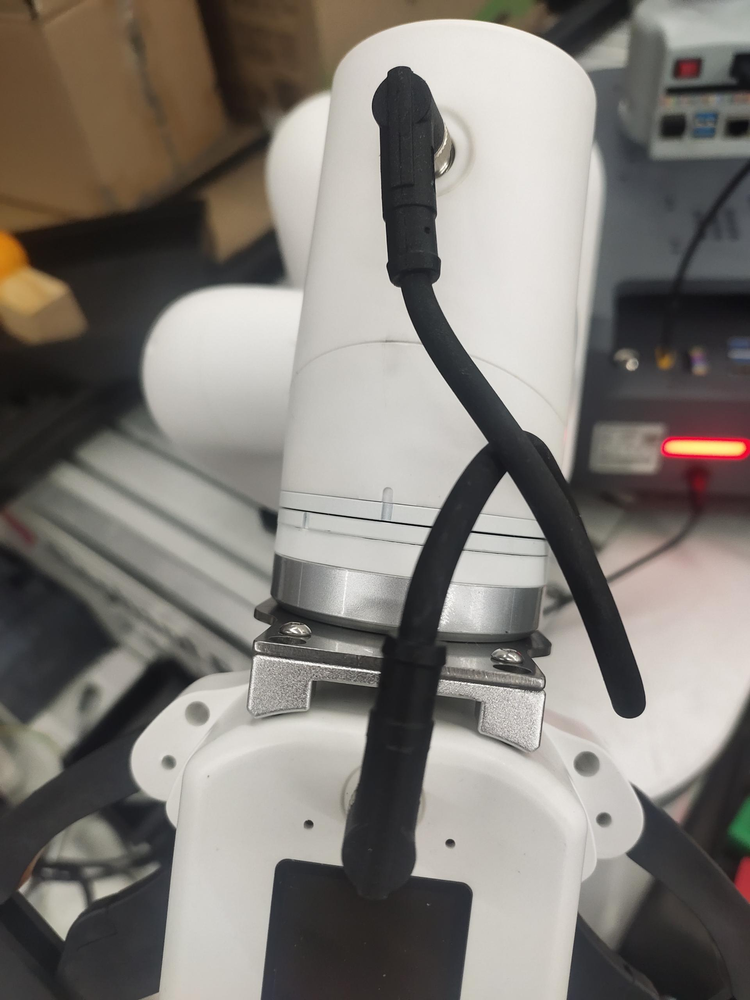
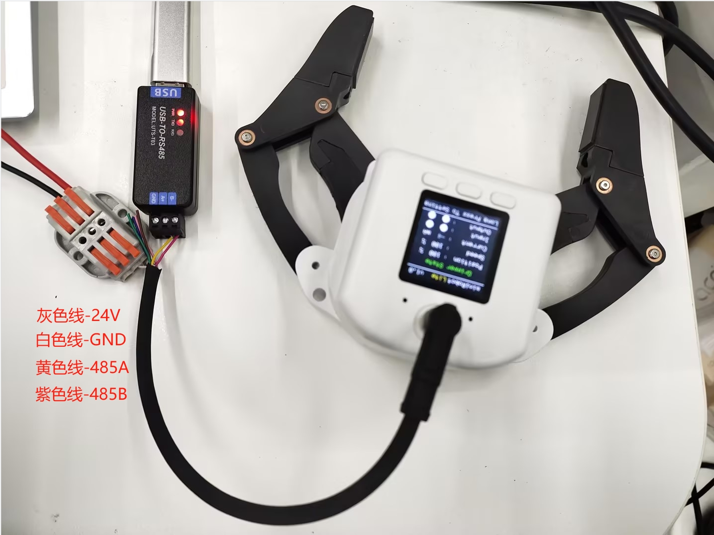

# 首次安装使用

## 1 夹爪和机械臂末端直连
**注意事项**：只有ER myCobot 320系列，ER Mercury A/B/X系列，ER myCobot Pro 630，ER myCobot Pro 600才能与夹爪通过M8航插线直连，其他厂家机械臂要参考夹爪的线序重新接线

**以mycobot320为例子,其余机型可参考此步骤进行安装**
用螺丝和垫片将夹爪连接件安装到机械臂末端法兰

再用螺丝将夹爪安装在连接件上

最后用M8航空线将夹爪和机械臂进行连接

## 2 夹爪和USB485模块连接

**USB-485模块接线**：

连接夹爪端的 24V，GND, 485_A(T/R+,485+) , 485_B(T/R-,485-)共 4 根线，电源为24V直流稳压电源，将模块的 USB 插口插入到电脑的 USB 接口

485A 接入 485 转 USB 模块 A+; 
485B 接入 485 转 USB 模块 B-; 
24V 接入 24V 直流稳压电源正极; 
GND 接入 24V 直流稳压电源负极 