# Screen control

The myCobot Pro force-controlled gripper has a screen display function, and there are buttons under the screen for easy operation of the screen. By selecting the interface, you can more conveniently control the gripper and understand the gripper information. Screen information and
Overall function description

|Interface|Function|
|:--|:--|
|Main interface|View the gripper information, such as: Position Set speed Current Input IO Output IO|
|Setting interface|View and set the gripper data|
|Set baud rate interface (Modbus Config)|View and change the device baud rate|
|IO enable interface (IO Config)|View and enable IO, the default IO is enabled|
|Gripper control interface (Manual Config)|Open-control the gripper to open Close-control the gripper to close Release-disable the gripper (the gripper will not have torque at this time, and the gripper can swing freely) Hold - enable the gripper (enable the gripper, and the gripper has torque at this time)|
|Version information interface (Information)|Firmware - Gripper Version Number and Gripper ID Servomotor - Servo Version Number and Servo ID|

**Main interface**

Entering the gripper main interface, we can see some real-time information of the gripper on the screen, which makes it easier to know the gripper information. The main interface mainly has the following information as shown in the figure

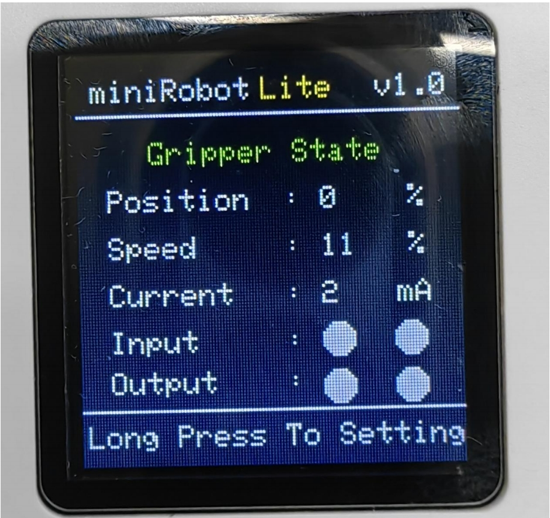

The main interface displays the gripper angle, speed, current, input and output IO level in real time

**Setting interface**

Press and hold the confirmation button for 2s in the main interface to enter the main interface

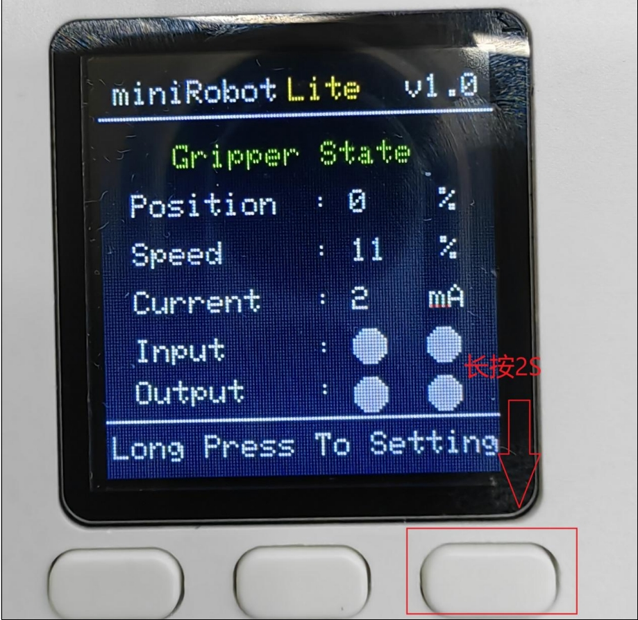

In the setting interface, you can move up and down and select by pressing the button

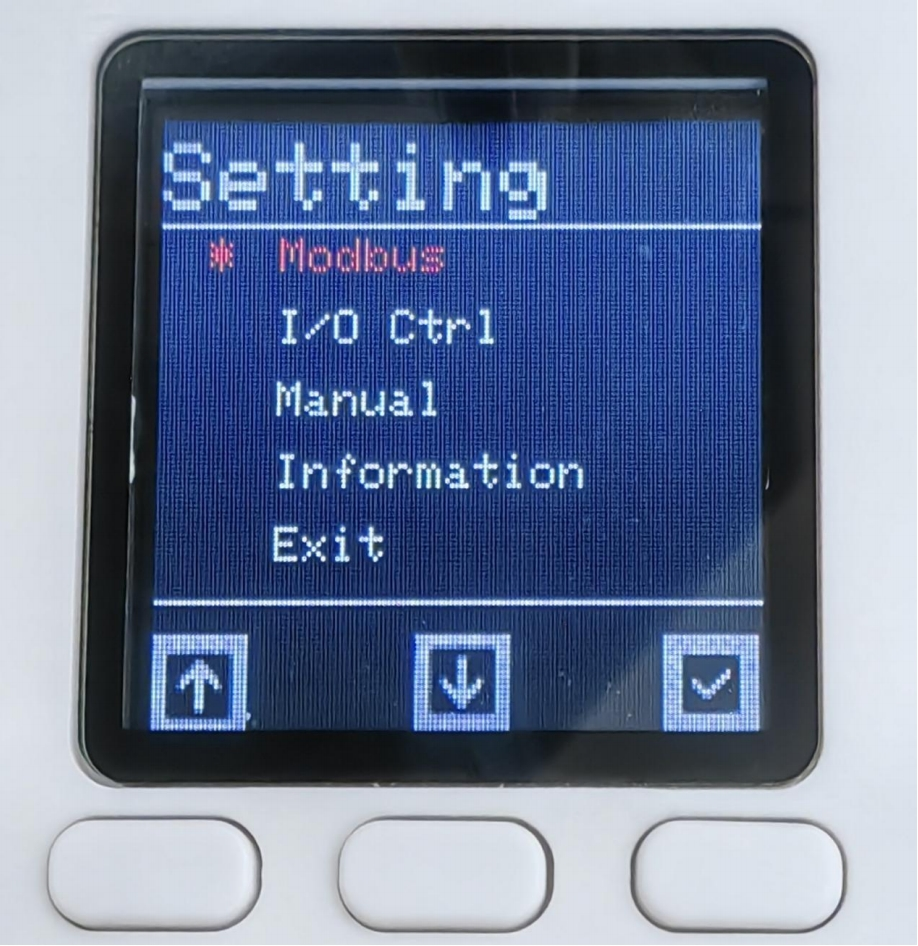

**Baud rate setting**

Click Modbus in the setting interface to enter the Modbud Config interface. Click Baudrate to enter the interface, select the baud rate you want to set and click Confirm. When the color of the origin next to the baud rate changes, it proves that the setting is successful

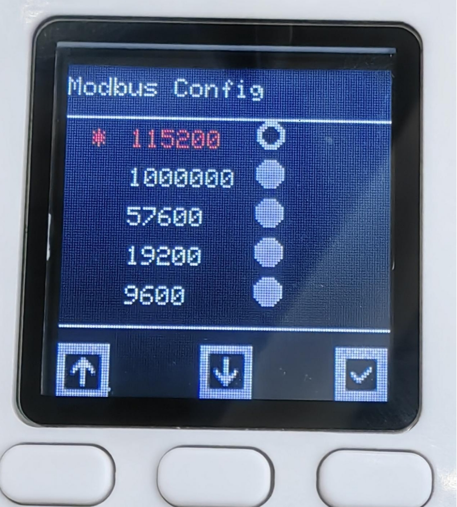

After setting, find Exit and click to exit the current interface

**IO Enable settings**

Select I/O Ctrl in the settings interface to enter the I/O Config interface. By default, IO is enabled. If it does not work, use IO control. You can select Disable to turn off IO control

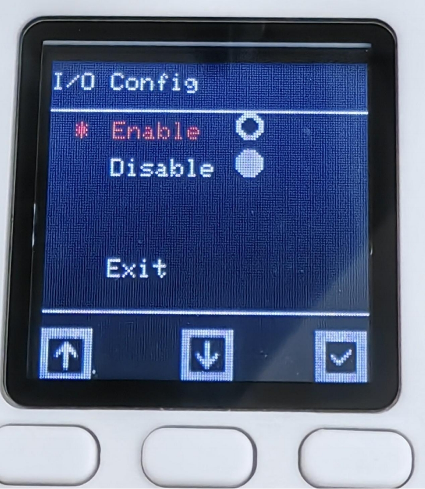

**Manual interface**

Select Manual in the settings interface to enter the Manual Control interface to quickly and conveniently control the gripper

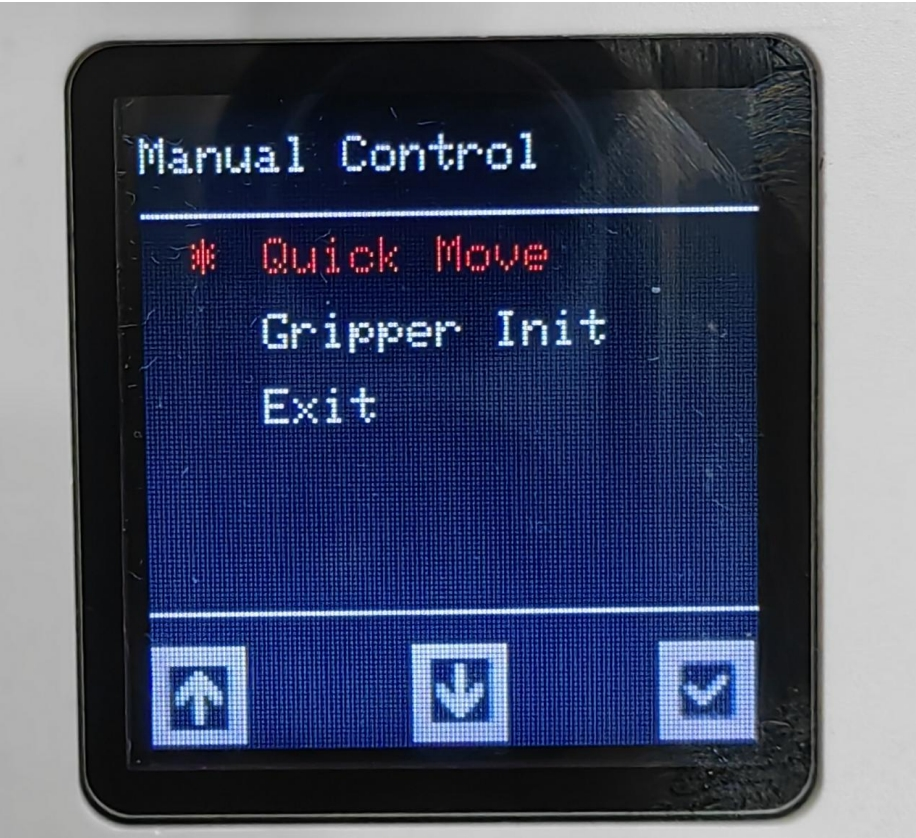

Select Quick Move to enter the gripper control interface, as shown in Figure 4.7. Select Gripper Init to enter the gripper configuration interface

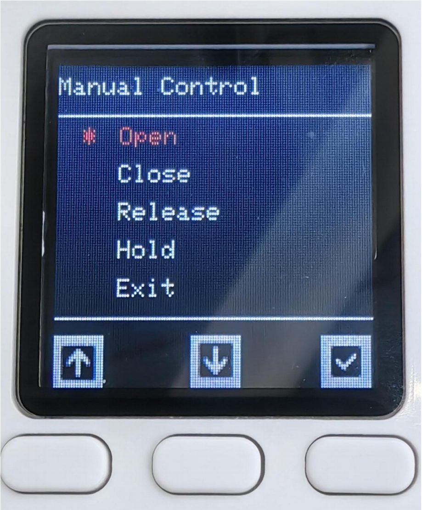

Open-set the gripper to open, Close-set the gripper to close, Pelease-set the gripper to disable, Hold-set the gripper to enable, Exit-exit the current interface

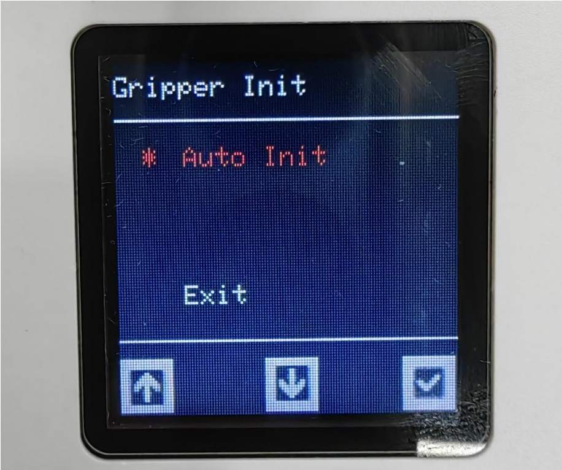

Select Auto Init to set the zero position of the gripper

**Information interface**

By selecting Information to enter the interface, we can see two options, Firmware and Servomotor. The former is the firmware version number. Click it to view the current firmware major and minor version numbers. The latter is to view the click information. Click it to see the ID and the main and minor versions of the motor.

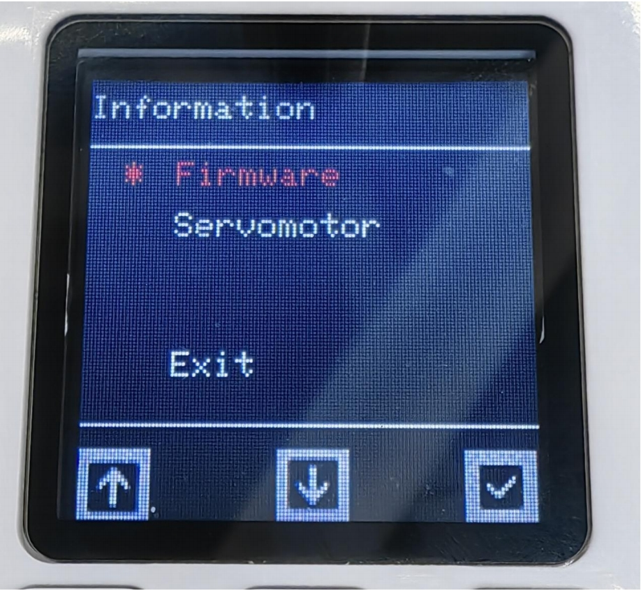

Click Firmware to view the firmware version and the ID in the device ID command

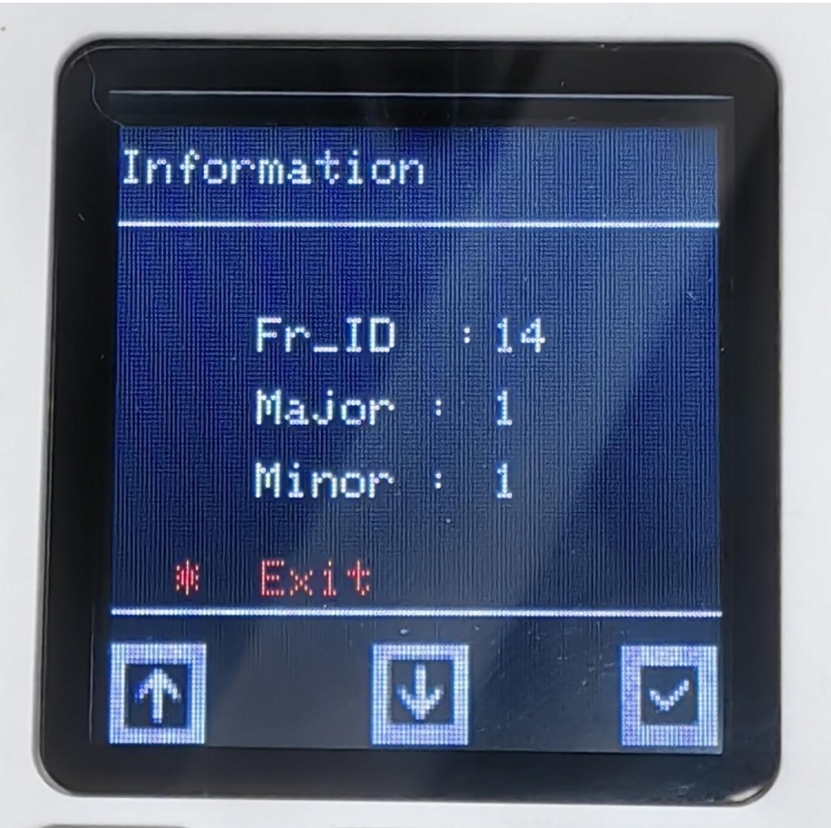

Click Servomotor to view the motor version and ID. The ID cannot be modified.

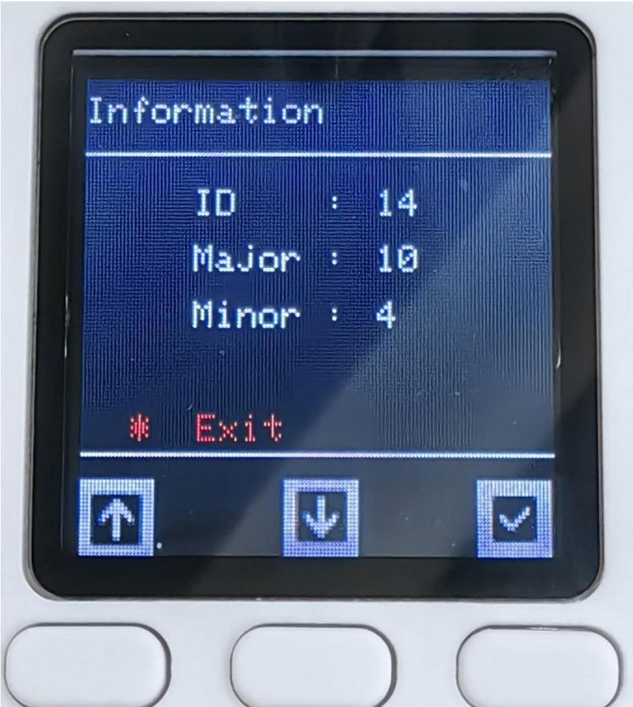

#### IO control

According to the above pin sequence description, find the line corresponding to OUT1 OUT2, input 24V, and when a high and a low level are input, the gripper will move. On the contrary, when a high and a low level are given, the gripper will move in the opposite direction. The IO input status can be observed on the main screen interface. When there is no IO input, it will appear white, and when there is IO input, it will appear black.

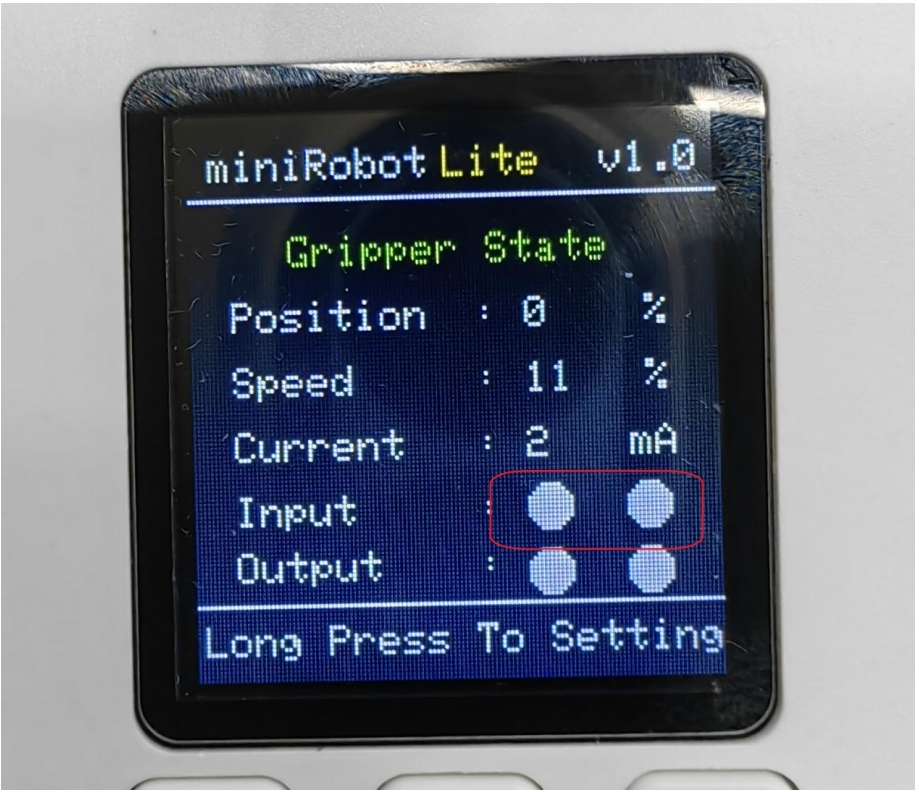