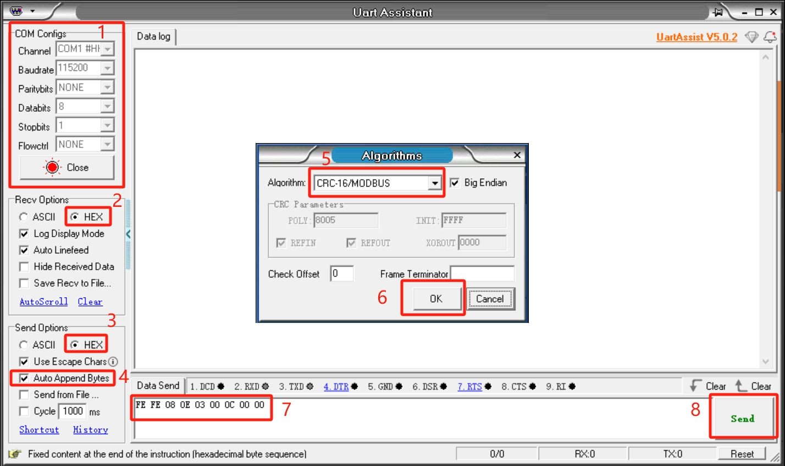

# Customized protocol control method

**USB-485 module wiring**:

Connect 24V, GND, 485_A (T/R+, 485+), 485_B (T/R-, 485-) at the gripper end, a total of 4 wires, the power supply is a 24V DC regulated power supply, insert the module's USB port into the computer's USB port

485A connected to 485 to USB module A+; 
485B connected to 485 to USB module B-; 
24V connected to 24V DC regulated power supply positive pole; 
GND connected to 24V Negative pole of DC regulated power supply 

**Serial port debugging assistant debugging**:

Users can use [UartAssist](https://www.nitwo.com/cn/download/UartAssist.html) serial port debugging assistant, refer to the figure below to send the corresponding gripper command, CRC checksum does not need to be filled in, UartAssist serial port debugging assistant will automatically generate it.

**Default configuration of the gripper serial port**
- Gripper ID: 14
- Baud rate: 115200
- Data bit: 8
- Stop bit: 1
- Check bit: No check bit

**Protocol usage instructions**

The gripper uses a custom protocol. An instruction consists of a frame header (2byte), length (1byte), address code ID (1byte), function code (1byte), register address (2byte), register data (2byte), and check code (2byte). Let's take reading the gripper angle as an example.

| Frame header | Length | ID | Function code | Register address | Register data/parameter | CRC-16MODBUS check code |
| :--- | :--- |:--- |:--- |:--- |:--- |:--- |
|Fe Fe| 08 |0e| 03 |00 0C|00 00|B1 C0|

**Frame header**: 254 254  

**Length**: Instruction length 08  

**ID**: 0E, can be modified in the device, the default ID is 14, 0E represents the current ID of the gripper is 14  

**Function code**: Identify whether the instruction is a setting or acquisition function, 06 (write operation to the register)/03 (read operation to the register).  

**Register address**: 00 0c Gripper function corresponding register address  

**Register parameter**: 00 00, no parameters are required in the read instruction, 00 00 can be given, and data is written to the gripper address for the parameter in the setting instruction.  

**CRC check**: B1 C0, to ensure that the terminal device does not respond to data that has changed during the transmission process, to ensure the security and efficiency of the system, the CRC check adopts the 16-bit cyclic remainder method. Verify all hexadecimal values ​​of frame header, length, function code, register address and register parameters directly to get B1 C0 verification code. 

#### Command Overview
- Read the firmware major version number

    Command: fe fe 08 0e 03 00 01 00 00 72 51

    Function code: 03 Read operation

    Parameter: None

    Return: fe fe 08 0e 03 00 01 00 01 B2 90

    Note: Data return 00 01, return version number is 1

- Read the firmware minor version number

    Command: FE FE 08 0E 03 00 02 00 00 72 A1

    Function code: 03 Read operation

    Parameter: None

    Return: FE FE 08 0E 03 00 02 00 01 B2 60

    Note: Data return 00 01, indicating that the return version number is 1

- Set/read device ID number
    - Set

        Command: FE FE 08 0E 06 00 03 00 0E 76 BD

        Function code: 06 write operation

        Parameter: 00 0E, ID setting range (1-254)

        Return: FE FE 08 0E 06 00 03 00 01 72 FD

        Note: Success returns 00 01, failure returns 00 00, after the device ID is modified, the ID in the instruction also needs to be modified
        to be the same to communicate

    - Read

        Instruction: FE FE 08 0E 03 00 04 00 00 73 41

        Function code: 03 read operation

        Parameter: None

        Return: FE FE 08 0E 03 00 04 00 0E B7 C0

        Note: Data return 00 0E, indicating the current gripper ID number

- Set/read 485 baud rate
    - Set

        Instruction: FE FE 08 0E 06 00 05 00 00 73 1D

        Function code: 06 write operation

        Parameter: parameter 00 00, 0-115200, 1-1000000, 2-57600, 3-19200, 4-9600, 5-4800,
        If set to 1000000, the parameter is changed to 00 01

        Return: FE FE 08 0E 06 00 05 00 01 72 FD
        
        Note: Success returns 00 01, failure returns 00 00
    - Read

        Command: FE FE 08 0E 03 00 06 00 00 B3 E0

        Function code: 03 read operation

        Parameter: None

        Return: FE FE 08 0E 03 00 06 00 00 B3 E0
        
        Note: Return data 00 00, the baud rate value corresponding to the setting parameter

- Set the gripper enable state

    Command: FE FE 08 0E 06 00 0A 00 00 B0 EC

    Function code: 06 write operation

    Parameter: 00 00, 00 means disconnect enable, 00 01 means enable

    Return: FE FE 08 0E 06 00 0A 00 01 70 2D

    Note: Success returns 00 01, failure returns 00 00

- Set/read the gripper angle
    - Set

        Command: FE FE 08 0E 06 00 0B 00 64 9B BC

        Function code: 06 write operation

        Parameter: Parameter 00 64, set the angle to fully open

        Return: FE FE 08 0E 06 00 0B 00 01 B0 7C

        Mark: Success returns 00 01, failure returns 00 00
    - Read

        Command: FE FE 08 0E 03 00 0C 00 00 B1 C0

        Function code: 03 Read operation

        Parameter: None

        Return: FE FE 08 0E 03 00 0C 00 64 5A C1

        Mark: Return data 00 64, indicating that the current angle is 100, fully open state

- Set the gripper zero position

    Command: FE FE 08 0E 06 00 0D 00 00 71 5D

    Function code: 06 Write operation

    Parameter: None

    Return: FE FE 08 0E 06 00 0D 00 01 B1 9C

    Mark: Success returns 00 01, failure returns 00 00

    **Note**: When setting the zero position, the gripper will move by itself. If there is an object blocking the movement, the setting will fail. Please check whether there are any obstacles around the gripper before setting.

- Read the gripper clamping status

    Command: FE FE 08 0E 03 00 0E 00 00 71 61

    Function code: 03 Read operation

    Parameter: None

    Return: FE FE 08 0E 03 00 0E 00 01 B1 A0
    Mark: 00 01, return data 0 is moving, 1 is stopped and no clamping is detected, 2 is stopped and clamping is detected, 3 is detected and the object falls

- Set/read the gripper P value
    - Set

        Command: FE FE 08 0E 06 00 0F 00 64 5A FD

        Function code: 06 Write operation

        Parameter: Parameter 00 64, set the P value 100, setting range (1-150)

        Return: FE FE 08 0E 06 00 0F 00 01 71 3D

        Note: Success returns 00 01, failure returns 00 00

    - Read

        Command: FE FE 08 0E 03 00 10 00 00 77 01

        Function code: 03 Read operation

        Parameter: None

        Return: FE FE 08 0E 03 00 10 00 64 9C 00
        
        Note: Return data 00 64, indicating that the current P value is 100

- Set/read the gripper D value
    - Set

        Command: FE FE 08 0E 06 00 11 00 64 5C 9D

        Function code: 06 Write operation

        Parameter: Parameter 00 64, set the D value 100, setting range (1-150)

        Return: FE FE 08 0E 06 00 11 00 01 77 5D

        Note: Success returns 00 01, failure returns 00 00

        **If the gripper shakes, the D value can be appropriately increased**

    - Read

        Command: FE FE 08 0E 03 00 12 00 00 B7 A0

        Function code: 03 Read operation

        Parameter: None

        Return: FE FE 08 0E 03 00 12 00 64 5C A1
        
        Note: Return data 00 64, indicating that the current D value is 100

- Set/read gripper I value
    - Set

        Command: FE FE 08 0E 06 00 13 00 00 77 3D

        Function code: 06 Write operation

        Parameter: Parameter 00 00, set I value to 0, setting range (1-150)

        Return: FE FE 08 0E 06 00 13 00 01 B7 FC
        
        Note: Success returns 00 01, failure returns 00 00
    - Read
        Command: FE FE 08 0E 03 00 14 00 00 B6 40

        Function code: 03 Read operation

        Parameter: None

        Return: FE FE 08 0E 03 00 14 00 00 B6 40

        Note: Return data 00 00, indicating that the current I value is 0

- Set/read the clockwise runnable error of the gripper
    - Set

        Command: FE FE 08 0E 06 00 15 00 01 B6 1C

        Function code: 06 Write operation

        Parameter: Parameter 00 01, setting value is 1, setting range (0-16)

        Return: FE FE 08 0E 06 00 15 00 01 B6 1C
        
        Note: Success returns 00 01, failure returns 00 00
    - Read

        Command: FE FE 08 0E 03 00 16 00 00 76 E1

        Function code: 03 Read operation

        Parameter: None

        Return: FE FE 08 0E 03 00 16 00 01 B6 20
        
        Note: Return data 00 01, indicating that the current value is 1

- Set/read the clockwise runnable error of the gripper
    - Set

        Command: FE FE 08 0E 06 00 17 00 01 76 BD

        Function code: 06 Write operation

        Parameter: Parameter 00 01, setting value is 1, setting range (0-16)

        Return: FE FE 08 0E 06 00 17 00 01 76 BD

        Note: Success returns 00 01, failure returns 00 00

    - Read

        Command: FE FE 08 0E 03 00 18 00 00 B5 80

        Function code: 03 Read operation

        Parameter: None

        Return: FE FE 08 0E 03 00 18 00 01 75 41
        
        Note: Return data 00 01, indicating that the current value is 1

- Set/read the minimum starting force of the gripper
    - Set

        Command: FE FE 08 0E 06 00 19 00 18 7F 1D

        Function code: 06 Write operation

        Parameter: 00 18

        Return: FE FE 08 0E 06 00 19 00 01 B5 DC

        Note: Success returns 00 01, failure returns 00 00

    - Read

        Command: FE FE 08 0E 03 00 1A 00 00 75 21

        Function code: 03 Read operation

        Parameter: None

        Return: FE FE 08 0E 03 00 1A 00 18 7F 21
        
        Note: Return data 00 18, indicating that the current value is 24

- Set/read torque
    - Set

        Command: FE FE 08 0E 06 00 1B 00 64 F8 BC

        Function code: 06 Write operation

        Parameter: 00 64 Set the torque to 100, parameter range (0-100)

        Return: FE FE 08 0E 06 00 1B 00 01 75 7D
        
        Note: Success returns 00 01, failure returns 00 00

    - Read

        Command: FE FE 08 0E 03 00 1C 00 00 74 C1

        Function code: 03 Read operation

        Parameter: None

        Return: FE FE 08 0E 03 00 1C 01 2C 39 C1
        
        Note: Return data 01 2C, indicating that the current value is 300, the greater the torque, the greater the current, and the gripper strength
        will also increase

- io output setting

    Command: FE FE 08 0E 06 00 1D 00 10 78 5D

    Function code: 06 Write operation

    Parameter: 00 10 Set IO output is 10, parameter range (00, 01, 10, 11)

    Return: FE FE 08 0E 06 00 1D 00 01 74 9D

    Note: Success returns 00 01, failure returns 00 00

- Set io opening angle
    - Set

        Command: FE FE 08 0E 06 00 1E 00 32 61 2D

        Function code: 06 Write operation

        Parameter: 00 32 Set IO opening angle to 50, parameter range (0-100)

        Return: FE FE 08 0E 06 00 1E 00 01 74 6D

        Note: Success returns 00 01, failure returns 00 00

    - Read

        Command: FE FE 08 0E 03 00 22 00 00 B8 A0

        Function code: 03 Read operation

        Parameter: None

        Return: FE FE 08 0E 03 00 22 00 32 6D 21
        
        Note: 00 32 Data return is 50 degrees

- Set io closing angle

    - Set

        Command: FE FE 08 0E 06 00 1F 00 00 74 FD

        Function code: 06 Write operation

        Parameter: 00 32 Set IO closing angle to 0, parameter range (0-100)

        Return: FE FE 08 0E 06 00 1F 00 01 B4 3C
        
        Note: Success returns 00 01, failure returns 00 00

    - Read

        Command: FE FE 08 0E 03 00 23 00 00 78 F1

        Function code: 03 Read operation

        Parameter: None

        Return: FE FE 08 0E 03 00 23 00 00 78 F1
        
        Note: 00 00 data return is 0 degrees

- Set/read the gripper speed
    - Set

        Command: FE FE 08 0E 06 00 20 00 32 AD 4C

        Function code: 06 Write operation

        Parameter: 00 32 Set the speed to 50, parameter range (1-100)

        Return: FE FE 08 0E 06 00 20 00 01 B8 0C
        
        Note: Success returns 00 01, failure returns 00 00
    - Read

        Command: FE FE 08 0E 03 00 21 00 00 B8 50

        Function code: 03 Read operation

        Parameter: None

        Return: FE FE 08 0E 03 00 21 00 32 6D D1

        Note: 00 32 data return is 50

- Set absolute angle
    Command: FE FE 08 0E 06 00 24 00 64 52 8D

    Function code: 06 Write operation

    Parameter: 00 64 Set absolute angle to 100, parameter range (0-100)

    Return: FE FE 08 0E 06 00 24 00 01 79 4D

    Note: Success returns 00 01, failure returns 00 00
    **Due to the long response time, if the user keeps sending this command, it will be put into the queue and executed one by one.
    The absolute angle will wait for the gripper to move to the specified position before returning the command. If there is an object blocking the movement during the movement, the gripper cannot move to the specified position and the failure command will be returned after the waiting timeout**

- Pause movement

    Command: FE FE 08 0E 06 00 25 00 00 79 DD

    Function code: 06 Write operation

    Parameter: None

    Return: FE FE 08 0E 06 00 25 00 01 B9 1C

    Mark: Success returns 00 01, failure returns 00 00

    **Pause motion acts on setting absolute angle. After sending this command, the absolute angle will not be executed from the queue
    Command**

- Resume motion

    Command: FE FE 08 0E 06 00 26 00 00 79 2D

    Function code: 06 Write operation

    Parameter: None

    Return: FE FE 08 0E 06 00 26 00 01 B9 EC

    Mark: Success returns 00 01, failure returns 00 00
    **Resume motion acts on setting absolute angle. This command can resume the execution of the absolute angle queue**

- Stop motion

    Command: FE FE 08 0E 06 00 27 00 00 B9 7C

    Function code: 06 Write operation

    Parameter: None

    Return: FE FE 08 0E 06 00 27 00 01 79 BD

    Note: Success returns 00 01, failure returns 00 00
    **Stop motion acts on the absolute angle, this instruction will clear the absolute instruction queue**

- Get the amount of data in the current queue

    Instruction: FE FE 08 0E 03 00 28 00 00 BA 80

    Function code: 03 Read operation

    Parameter: None

    Return: FE FE 08 0E 03 00 28 00 00 BA 80

    Note: 00 00, indicating that the number of instructions in the absolute angle queue is 0
    **This instruction acts on setting the absolute angle, and this instruction can get the number of instructions in the absolute angle queue**

- Set the virtual position value of the servo
    - Set

        Command: FE FE 08 0E 06 00 29 00 08 BC 1C

        Function code: 06 Write operation

        Parameter: 00 08 Set the gripper position error range, parameter range (0-254)

        Return: FE FE 08 0E 06 00 29 00 01 BA DC
        
        Note: Success returns 00 01, failure returns 00 00

    - Read

        Command: FE FE 08 0E 03 00 2A 00 00 7A 21

        Function code: 03 Read operation

        Parameter: None

        Return: FE FE 08 0E 03 00 2A 00 08 BC 20

        Note: 00 08 Data return 8
        **The default value is 8. The larger the virtual position setting, the lower the accuracy of the gripper position determination**

- Set/read gripping current
    - Set

        Command: FE FE 08 0E 06 00 2B 00 FE 3A 3D

        Function code: 06 Write operation

        Parameter: 00 FE Set gripping current to 254, parameter range (0-254)

        Return: FE FE 08 0E 06 00 2B 00 01 7A 7D

        Note: Success returns 00 01, failure returns 00 00

    - Read

        Command: FE FE 08 0E 03 00 2C 00 00 7B C1

        Function code: 03 Read operation

        Parameter: None

        Return: FE FE 08 0E 03 00 2C 00 FE FB 40
        
        Note: 00 FE Data return 254, when setting the torque, the current of the clamped object will adapt accordingly. This command can set the clamping current by yourself.