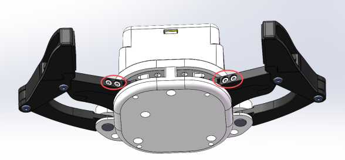
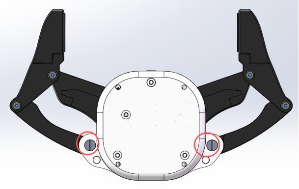
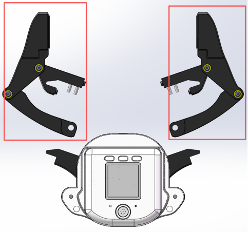

# 柔性夹爪更换操作步骤说明

| Serial Number  | Operation Diagram | Detailed Operation Instructions |
|------|---------|-----------|
| 1 |  | Use an Allen wrench with a diagonal width of 2mm to remove the 4 screws shown in the left diagram, and keep the removed screws as they will be used for the subsequent installation of the flexible gripper. |
| 2 |  | Use a flat-head screwdriver to remove the two flat-head screws at the lower end of the gripper. |
| 3 |  | After the two sets of screws mentioned above are removed, the original gripper part can be separated. |
| 4 |  | Replace the flexible fingertips and place them at the positions of the left and right movement rods respectively. Use an Allen wrench with a diagonal width of 2mm to re-tighten the screws that were originally removed from the same positions |