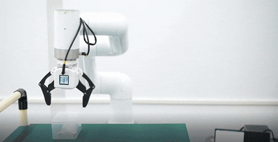
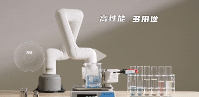

# 场景案例
mycobot320 力控夹爪使用案例,[案例更多内容](https://docs.elephantrobotics.com/docs/mycobot_320_m5_cn/1-ProductIntroduction/1.4-AccessoriesTools/1.4.1-Gripper/jiazhua_m5.html#63-python%E6%8E%A7%E5%88%B6%E5%9C%BA%E6%99%AF%E6%A1%88%E4%BE%8B)

C3 力控夹爪使用案例

myCobot pro630 力控夹爪使用案例

