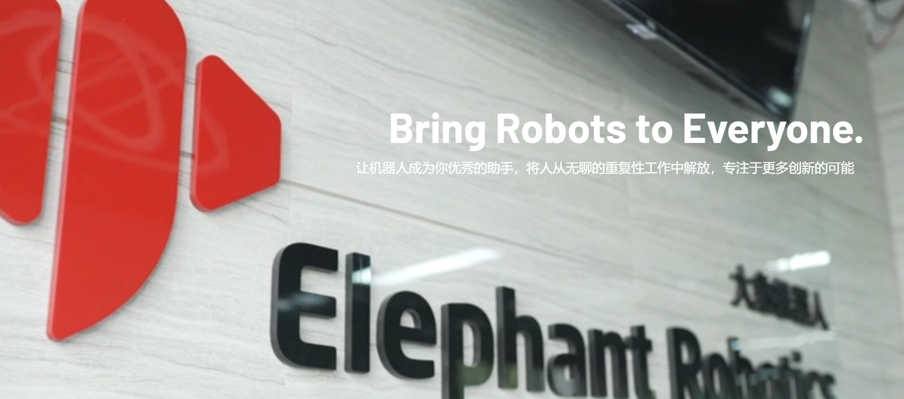
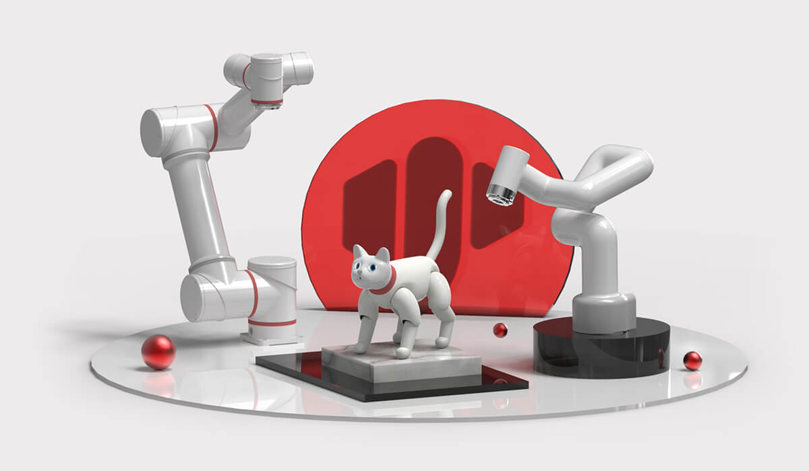

# Elephant Robotics

## 1 Company Profile
&emsp;&emsp;Elephant Robotics is based in Shenzhen, China, and is a high-tech enterprise focusing on robot R&D, design and automation solutions.
&emsp;&emsp;We are committed to providing highly flexible collaborative robots, easy-to-learn operating systems and intelligent automation solutions for robot education and scientific research institutions, commercial scenarios and industrial production. Its product quality and smart solutions have been unanimously recognized and praised by several factories from the world's top 500 companies in South Korea, Japan, the United States, Germany, Italy, Greece and other countries.
Elephant Robotics adheres to the vision of "Enjoy Robots World", advocates the collaborative work of people and robots, makes robots a good helper for human work and life, helps people free themselves from simple, repetitive and boring work, gives full play to the advantages of human-machine collaboration, and thus improves work efficiency and helps humans create a better new life.
&emsp;&emsp;In the future, Elephant Robotics hopes to promote the development of the robotics industry through a new generation of cutting-edge technology, and work together with customers and partners to open a new era of automation and intelligence.

## 2 Development History
2016.08 -----Elephant Robotics Co., Ltd. was officially established
2016.08 -----Entered the HAX incubator and received seed round investment from SOSV
2016.08 -----Started to develop the Elephant S industrial collaborative robot
2017.01 -----Rated as "Top 10 Most Innovative Companies in China at CES"
2017.04 -----Attended the Hannover Industrial Fair and the Korea Automation Exhibition
2017.07 -----The two founders were selected as "30 Business Elites Under 30" by Forbes Asia
2017.10 -----The fifth-generation single-arm industrial collaborative robot Elephant S was launched
2018.04 -----Received angel round investment from "Yun Angel Fund"
2018.06 -----First public appearance at the 2018 Hannover World Industrial Fair
2018.06 -----Won the "Smart Manufacturing Entrepreneurship MBA Award" from Cheung Kong Graduate School of Business
2018.06 -----Won the "Entrepreneurship Accelerator X-elerator Award" from Tsinghua School of Economics and Management
2018.11 -----Won the second place in the Shenzhen Division of the Asian Smart Hardware Competition
2018.11 -----Won the "Most Investment Enterprise Award" from the Gaogong Golden Globe Award
2019.03 -----Won the "Leadership Award" from the Gaogong Golden Globe Award
2019.04 -----March 2019 Catbot won the "Industrial Robot Innovation Award"
2019.09 -----Attended the Huawei European Ecosystem Conference (HCE) and officially became a member of Huawei's ecological partner
2019.11 -----Elephant Robot and Harbin Institute of Technology attended the IROS International Intelligent Robot and System Conference
2019.12 -----The "Intelligent Robot Joint Development Laboratory" of Elephant Robot and South China University of Technology was officially unveiled
2019.12 -----Won the 2019 "Innovation Technology Award" from Gaogong
2019.12 -----Won the "Top Ten Fast-Growing Enterprises" of Gaogong in 2019
2019.12 -----Won the "New Enterprise Award" in the Industrial Robot Segment of Shenzhen Equipment Industry
2019.12 -----The world's first bionic robot cat MarsCat was launched
2020.05 -----The founder won the Shenzhen Robot Newcomer Award in 2019
2020.10 -----The world's lightest and smallest six-axis collaborative robot myCobot was launched
2021.03 -----The smallest collaborative robot for scientific research myCobotPro 320 was launched
2021.05 -----Mars bionic cat MarsCat received competitive coverage from Xinhua Finance, China Daily, Nanjing Daily, Harbin Daily and other media
2021.07 -----Released the smallest composite robot chassis - the Little Elephant mobile robot myAGV
2021.09 -----The world's first fully enclosed four-axis robot arm - the Little Elephant palletizing robot myPalletizer was launched

## 3 Related links
+ **Official website**: https://www.elephantrobotics.com

+ **Purchase link**

* **Taobao**: https://shop504055678.taobao.com

* **shopify**: https://shop.elephantrobotics.com/
+ Video
* **bilibili**: https://space.bilibili.com/2126215657

* **youtube**: https://www.youtube.com/c/Elephantrobotics